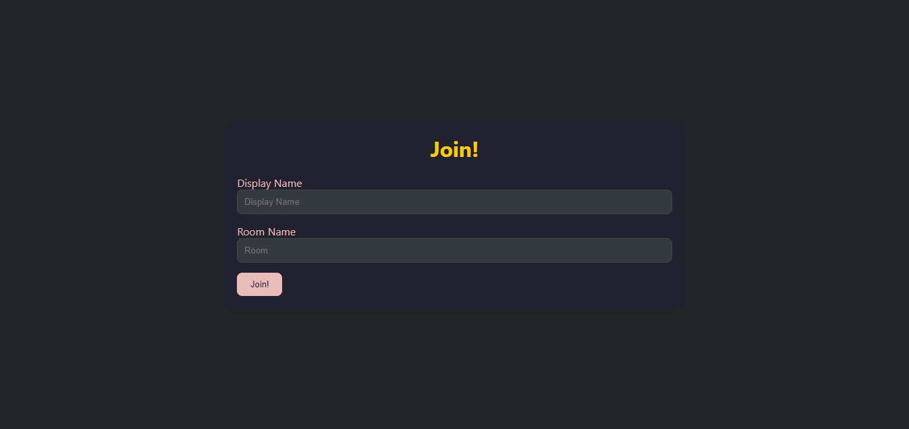
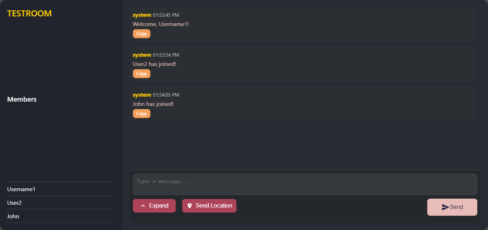

# Chat App

## Description

Chat App is a real-time chat application built with Node.js, Express, and Socket.IO. It allows users to join chat rooms, send messages, and share their locations with other users in real-time. The application features a modern and responsive design, making it easy to use on both desktop and mobile devices.

## Features

- **Real-time Messaging**: Send and receive messages instantly.
- **Location Sharing**: Share your current location with other users.
- **User Management**: Join different chat rooms with unique usernames.
- **Responsive Design**: Works seamlessly on both desktop and mobile devices.
- **Profanity Filter**: Prevents the use of inappropriate language in chat.

## Technologies Used

- **Node.js**: JavaScript runtime for building the server.
- **Express**: Web framework for Node.js.
- **Socket.IO**: Enables real-time, bidirectional communication between clients and servers.
- **HTML/CSS**: For structuring and styling the application.
- **JavaScript**: For client-side interactivity.

## Installation

1. Clone the repository:
   ```bash
   git clone https://github.com/SouravFrank/FrankChatOn.git
   cd chat-app
   ```

2. Install the dependencies:
   ```bash
   npm install
   ```

3. Start the application:
   ```bash
   npm run dev
   ```

4. Open your browser and navigate to `http://localhost:8080`.

## Usage

1. Enter your display name and room name in the input fields on the home page.
2. Click the "Join!" button to enter the chat room.
3. Start sending messages and sharing your location with other users in the room.

## Screenshots

 


## Contributing

Contributions are welcome! Please feel free to submit a pull request or open an issue for any suggestions or improvements.

## Acknowledgments

- [Socket.IO](https://socket.io/) for real-time communication.
- [Express](https://expressjs.com/) for building the web server.
- [Bad Words](https://www.npmjs.com/package/bad-words) for profanity filtering.

---
**Calling All Chat App Enthusiasts!**

We're on a mission to make our chat app the most epic online hangout spot ever! And we need YOUR help to make it happen!

Got a brilliant idea for a new feature? Think you can make our app more awesome? We want to hear from you! Create a pull request and share your thoughts with us!

**Warning:** our app may cause excessive laughter, spontaneous friendships, and a strong urge to chat all day. Prolonged use may lead to permanent smiles and a sense of community.

So, what are you waiting for? Join the fun and help us create the ultimate chat experience!

**Create a PR now and let's get this chat party started!**

